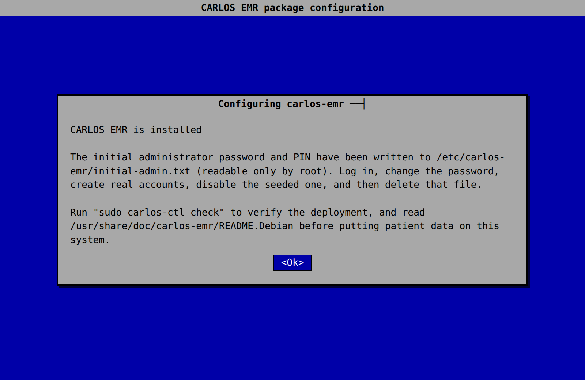

# Installing CARLOS on a single server (Debian packages)

This is the supported way to run CARLOS EMR on one Ubuntu machine: two Debian
packages that install the application, its database, an nginx + ModSecurity
web application firewall, HTTPS, scheduled encrypted backups, and an
administration tool — a working, secured EMR from `apt install`.

> **Status: pre-production.** A site considering production use must complete
> its own technical, security, privacy, backup, restore, and regulatory
> review before this system holds patient information. The installed
> documentation calls out the decisions only an operator can make.

| Package | What it provides |
|---|---|
| `carlos-emr` | CARLOS on a dedicated Tomcat 11 instance, MariaDB with least-privilege accounts, an nginx front door running ModSecurity 3 + OWASP CRS in blocking mode, HTTPS (self-signed by default, Let's Encrypt on request), nightly restic backups with a weekly restore drill, and the `carlos-ctl` admin CLI |
| `carlos-emr-drugref` | DrugRef2, the drug and drug-interaction reference CARLOS queries when prescribing — co-deployed, loopback-only, with the Health Canada Drug Product Database seed loaded on install |

## Requirements

- Ubuntu 26.04 LTS (the packages target its Tomcat 11 / OpenJDK 21 / MariaDB
  11.8 / nginx stack).
- One dedicated server or VM. As a starting point: 4+ CPU cores, 8 GB RAM
  (2 GB JVM heap + 1 GB database buffer pool by default — both tunable),
  and disk sized for your document store plus backups.
- Root access. The *installation* uses root; the *running system* does not —
  every long-lived component runs as an unprivileged account.

## Install

Every CARLOS [GitHub release](https://github.com/carlos-emr/carlos/releases)
carries both `.deb` files, their `.sha256` checksums, and build-provenance
attestations (the `carlos-emr` package ships that release's published WAR,
byte for byte). Download the pair, verify, install:

```bash
sha256sum -c carlos-emr_<version>_all.deb.sha256
sha256sum -c carlos-emr-drugref_<version>_all.deb.sha256
sha256sum -c carlos-emr-eform-renderer_<version>_amd64.deb.sha256
sudo apt install ./carlos-emr_<version>_all.deb \
                 ./carlos-emr-drugref_<version>_all.deb \
                 ./carlos-emr-eform-renderer_<version>_amd64.deb
```

Three packages, and it is worth knowing what each is for:

| Package | What it does | Leave it out? |
|---|---|---|
| `carlos-emr` | The EMR itself: application, database schema, nginx front door, WAF, TLS, backups. | No. |
| `carlos-emr-drugref` | Drug and interaction lookups when prescribing. | Only if you never prescribe — searches return nothing without it. |
| `carlos-emr-eform-renderer` | The browser that turns saved eForms into PDFs. | Only if the clinic does not use eForms — **there is no fallback**, so eForm print, fax and archive simply do not work without it. |

apt may print this while installing local files. It is harmless:

```
Notice: Download is performed unsandboxed as root as file '...deb'
couldn't be accessed by user '_apt'. - pkgAcquire::Run (13: Permission denied)
```

apt drops to an unprivileged user to fetch packages, and Ubuntu creates home
directories that user cannot read into. Nothing is downloaded from the network
by that step — the file is already on disk and you have just checksummed it.
Installing from a world-traversable directory such as `/tmp` avoids it.

### The installer's questions

The installer asks a handful of questions through debconf. Every answer has a
safe default and can be changed afterwards — **except the billing province**,
which selects the database schema and cannot be switched without starting from
an empty database. (The dialogs below are rendered from the package's debconf
templates; on a text terminal debconf shows the same text through `whiptail`.)

**1. Host name** — becomes the nginx `server_name` and the TLS certificate
subject. Use the fully-qualified name clinicians will reach the server at.


**2. Listen address** — `0.0.0.0` serves every interface (the usual clinic
setup); `127.0.0.1` keeps it local while staging or behind a separate proxy.
The application server and database always listen on loopback only.


**3. Billing province** — Ontario (`on`) or British Columbia (`bc`).
**This one is permanent** — the two provinces create different tables.


**4. Java heap** — CARLOS needs at least `2g`; on a dedicated box give it about
half of physical memory (leave room for MariaDB and ~1 GB for the OS).


**5. TLS mode** — `selfsigned` (HTTPS from minute one, browsers warn until you
replace it), `acme` (free Let's Encrypt cert; needs public DNS + port 80), or
`manual` (you supply the chain and key).


**6. Let's Encrypt email** — shown only when TLS mode is `acme`. Leave empty to
skip requesting a certificate now.


**7. Replace the seeded admin password** — the migrations seed `carlosdoc` with
a password published in the source repository. Accept (the default) to replace
it with random values written to `/etc/carlos-emr/initial-admin.txt`
(root-only). Decline **only** on a throwaway development machine.


**8. Done** — a final note tells you where the initial credentials were written
and points you at `carlos-ctl check` and `README.Debian`.



Installation then provisions the database and its accounts, applies the
schema with Flyway, replaces the seeded administrator credential with random
values, generates a self-signed certificate, wires nginx, and starts the
application. The webapp takes about two minutes to deploy; the installer
waits and says so.

To build the packages from source instead, see the header of
[`debian/rules`](../debian/rules) — including how to reuse a prebuilt WAR —
and [`release/README.md`](../release/README.md) for where the packaging
lives and why.

## Quickstart — the first hour

**1. Verify the deployment.** One command probes the whole system — services,
process ownership, network exposure, TLS, live WAF blocking, a live DrugRef
lookup, schema state, and backup freshness:

```bash
sudo carlos-ctl check
```

Then confirm the eForm render browser specifically, because `carlos-ctl check`
covers the EMR rather than that service:

```bash
sudo systemctl status carlos-emr-chromedriver          # should be active
sudo carlos-ctl logs | grep -i "renderer startup check"
```

You want `eForm browser renderer startup check passed.` The browser runs as its
own account (`carlos-render`) under its own service, sandboxed — if it cannot
start, eForm print/fax/archive fail rather than quietly producing PDFs from an
unsandboxed browser, and the line above tells you so at boot instead of at the
moment a clinician tries to print.

**2. Know where the logs are.** Before anything goes wrong, not after. CARLOS
spans several services and each writes to its own place — looking in the wrong
one is the most common way to conclude "nothing is logged":

```bash
sudo carlos-ctl logs -n 200        # the EMR and Tomcat  (= journalctl -u carlos-emr)
sudo carlos-ctl logs -f            # follow it live
sudo journalctl -u carlos-emr-chromedriver -n 50   # the eForm render browser
sudo journalctl -u nginx -n 50     # TLS and the front door
sudo tail -f /var/log/carlos-emr/modsec/modsec_audit.log   # the WAF
```

Two that catch people out:

- A request **blocked by the WAF never reaches the application**, so it appears
  in the modsec log and nowhere else. `carlos-ctl waf tail` explains why.
- The **render browser is a separate service with a separate journal**. A failed
  eForm print can leave the application log completely silent.

**3. Log in.** The initial administrator credentials were generated at
install time and written, readable only by root, to:

```bash
sudo cat /etc/carlos-emr/initial-admin.txt
```

Browse to `https://<your-host>/` (the browser warns about the self-signed
certificate until you replace it — the connection is still encrypted). The
seeded account lands on a **forced password reset** first — deliberate,
because the generated password exists in a file on disk. Complete the reset,
create real named accounts for each clinician, disable the seeded account,
and delete the credentials file.

**4. Point backups off the host.** The default backup repository is a local
directory — a real first tier, but not disaster recovery. Set an offsite
`RESTIC_REPOSITORY` in `/etc/carlos-emr/backup.env`, **copy the
`RESTIC_PASSWORD` somewhere off this machine** (without it every backup is
permanently unreadable), and prove the pipeline end to end:

```bash
sudo carlos-ctl backup full
sudo carlos-ctl backup verify   # restores the newest dump into a scratch db
```

**5. Real TLS.** Once the host name resolves in public DNS and port 80 is
reachable:

```bash
sudo carlos-ctl cert acme you@example.ca
```

## Day-two administration

The loop is: edit the file, run the verb beside it.

| You edited | Then run |
|---|---|
| `/etc/carlos-emr/carlos-emr.env` (host name, listen address, heap, timezone) | `sudo carlos-ctl init-config` — re-renders *and applies*: nginx reload, certificate refresh, and it tells you if a restart is also needed |
| `/etc/carlos-emr/carlos.properties` (application settings) | `sudo carlos-ctl restart` |
| `/etc/carlos-emr/backup.env` | nothing — the next timer run reads it; prove it with `carlos-ctl backup full` |
| `/etc/carlos-emr/modsecurity/` (WAF policy, site exclusions) | `sudo carlos-ctl waf reload` |

`carlos-ctl --help` lists every verb; `man carlos-ctl` documents them. The
tool shares its name, language, and overlapping verb set (`check`, `db`,
`db-migrate`, `db-users`, `backup full|verify|status`, `cert-renew`,
`rotate`) with the carlos-podman deployment's `carlos-ctl`, so operators can
move between the two without relearning.

Upgrades are `apt install` of the newer pair: the schema migrates before the
service restarts, your configuration files are never overwritten, and the
application refuses to start against a schema it was not built for rather
than failing mid-consultation.

**Removing the packages never destroys clinical data.** Neither `remove` nor
`purge` touches the databases, the document store, the backups, or the two
files whose loss would make retained data unreadable. Deliberate
decommissioning is its own explicit command
(`carlos-ctl destroy-data --confirm <server-name>`), which requires typing
the host's own configured name back to it.

## The full operator reference

The complete documentation installs with the package and covers what this
page compresses: the security model and what runs as whom, WAF tuning and
the false-positive workflow, point-in-time restore, log retention as a
compliance decision, and the decisions marked **DECIDE THIS**:

```
/usr/share/doc/carlos-emr/README.Debian
/usr/share/doc/carlos-emr-drugref/README.Debian
man carlos-ctl
```

## Other installation methods

- **Development:** the [devcontainer](../.devcontainer/README.md) is the
  supported development environment — synthetic data, disposable, not for
  patient information.
- **Containers (under development):**
  [carlos-podman](https://github.com/carlos-emr/carlos-podman) deploys
  CARLOS as rootless Podman pods with a separate WAF pod, an optional
  observability stack (metrics, log search, alerting), TPM-sealed secrets,
  and Ansible-driven multi-instance provisioning — a richer operational
  surface for sites that want it, where this package deliberately stays
  simple. Start with its
  [README](https://github.com/carlos-emr/carlos-podman#readme) and
  [QUICKSTART](https://github.com/carlos-emr/carlos-podman/blob/main/QUICKSTART.md).
