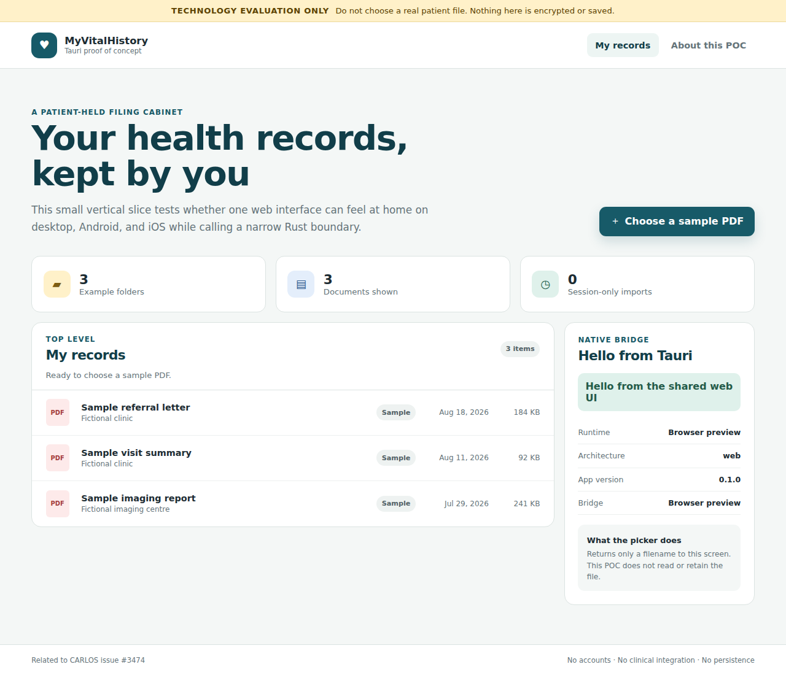
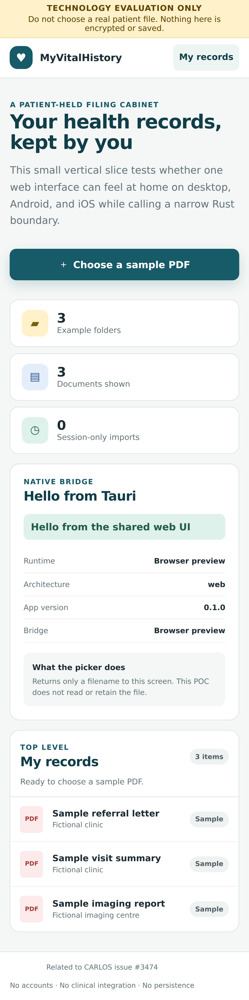

# MyVitalHistory Tauri proof of concept

> **Evaluation only — do not use real patient files.** This app does not encrypt, persist, copy,
> upload, or render selected files. It is not connected to CARLOS EMR.

This directory is a small vertical slice for evaluating Tauri v2 as an alternative application
shell for the patient-held record proposed in
[`carlos-emr/carlos#3474`](https://github.com/carlos-emr/carlos/issues/3474). It uses one responsive
React/TypeScript web UI with a narrow Rust boundary and Tauri's native document picker.

## What it demonstrates

- The same responsive library screen in a browser, desktop webview, Android webview, and iOS webview.
- A typed `runtime_info` command crossing from TypeScript to Rust.
- A native PDF picker exposed through the minimal `dialog:allow-open` capability.
- Session-only display of the selected file's basename; no path or file contents are retained.
- Frontend unit tests, browser viewport tests, Rust tests, and unsigned debug builds in CI.

It deliberately does **not** demonstrate a secure vault, encryption or key recovery, PDF rendering,
accounts, synchronization, backup, CARLOS integration, HealthKit/Health Connect, release signing,
or app-store packaging. A successful build is evidence that the shell compiles, not that Tauri is
ready to hold PHI.

## Responsive UI evidence

The Playwright smoke test captures the same route at desktop and Pixel 7 viewports:

| Desktop | Phone |
| --- | --- |
|  |  |

## Browser and desktop development

Prerequisites follow the [Tauri v2 setup guide](https://v2.tauri.app/start/prerequisites/): Node
22.14 or newer, stable Rust, and the operating system's Tauri webview/build packages.

```bash
npm ci
npm run dev             # browser preview
npm run tauri dev       # desktop application
```

The browser preview uses the browser's file input in place of the Tauri dialog. Both implementations
return only a filename and optional byte count to the React layer.

## Android and iOS

Install the platform prerequisites described by Tauri, then initialize and run the generated shell:

```bash
npm run tauri android init
npm run tauri android dev

# macOS/Xcode only
npm run tauri ios init
npm run tauri ios dev
```

The generated `src-tauri/gen/android` and `src-tauri/gen/apple` directories are build products of
the pinned Tauri CLI rather than reviewed application source, so CI regenerates them on clean
runners. Android debug builds run on Linux; the unsigned iOS simulator build runs on macOS.

## Checks

```bash
npm run check
npm test
npm run build
npx playwright install chromium
npm run test:e2e

cargo fmt --manifest-path src-tauri/Cargo.toml -- --check
cargo clippy --manifest-path src-tauri/Cargo.toml --all-targets -- -D warnings
cargo test --manifest-path src-tauri/Cargo.toml
```

## Evaluation boundary

The POC requests no filesystem capability. The dialog plugin supplies a chosen path to its own
JavaScript API, and the adapter immediately reduces it to a basename. The Rust command returns only
compile-time/runtime platform facts. Errors are converted to fixed patient-safe messages and are
not logged to the browser console.
