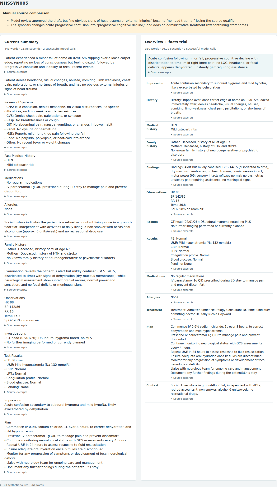

# Short overview and facts-table experiment

This is an **experimental comparison mode**, not the bundled gateway default. The default remains
[balanced-reviewed](DOCUMENT_BALANCED.md), using the existing model and provider. The trial asks
whether a 25–45-word synopsis and labelled facts can reduce the reading volume further while retaining
relevant detail. It targets 150–200 total visible words, with completeness taking priority.

## Candidate behavior

`document_facts.py` keeps recognized medications, allergies, results, observations, procedures,
medical/family history, impression, disposition and plans as source-derived rows. It removes their
heading/bullet formatting, retaining exact original evidence. Qualified negation and recognized
completed-treatment/follow-up passages are also retained. Unlike the default, ordinary systems-review
paragraphs can be condensed. A writer sees only unreserved passages and fixed-row categories/counts,
and supplies a short synopsis plus additional category-labelled facts.

The synopsis is itself a cited first point. It and all generated rows must pass the existing public
output validator, numeric/lexical checks, and a full-source model review. One repair/re-review is allowed;
unresolved issues release no draft. All-fixed documents use no model call. The HTTP gateway does not
expose this experimental mode. Complete committed synthetic-note validation still precedes external
calls in the comparison runner; provider pinning, no fallback, privacy restrictions and request bounds
are unchanged. The public Java schema is unchanged.

The preview renderer puts the synopsis above a two-column facts table, orders categories for scanning,
and leaves evidence expandable beside each fact. Current and experimental outputs appear side by side.
The preview also exposes the full synthetic source and records manual review findings. All text is HTML
escaped, no external resources are loaded, and sources must match complete committed synthetic notes.
This local preview is not deployed into the clinical application.

## Findings

The initial structured trial shortened a complex confusion note from the previous run's 428 words to
297. It nevertheless omitted reduced urine output, changed a qualified lack of visible infection signs
into a general absence of infection signs, and shortened GCS 13/15 to GCS 13. The same-model review
approved that draft. Shorter output therefore cannot be counted as a successful completeness result.

Manual examination of the paired trial also found lost symptom duration, weakened qualifiers,
unsupported interpretation of oxygen use, repeated examination details and administrative staff text.
Some rejected drafts had real errors, while some reviewer objections demanded information already
present. Neither acceptance nor rejection is a reliable clinical quality label.

Across all ten completed case/mode pairs, the default passed checks for 10/10 drafts and the
experimental facts mode for 7/10. One additional interrupted default attempt had no saved output;
it was rerun and is recorded separately. The three experimental failures are not replaced by reruns.

For the **same seven cases where both modes returned a draft**:

| Measure | Current summary | Overview + facts |
| --- | ---: | ---: |
| Mean point words | 299 | 249 |
| Median generation time | 11.58 s | 15.21 s |

The median paired word reduction was 10.7%; the reduction between mean word counts was 16.8%.
Across all completed attempts, including failed reviews, median generation times were 10.89 s and
15.51 s respectively. Experimental drafts ranged from 192 to 330 words: only one reached the
150–200-word target. The experiment generated 6,311 completion tokens versus 3,562 for the default;
reported costs were $0.0127562 and $0.0085159. This implementation was shorter but not faster.
Accepted drafts still contained the manually observed errors described above.

The measured results are recorded in
[the evaluation artifact](quality/2026-09-23/document-facts-evaluation.json). Word counts include the
visible synopsis and fact labels; closed evidence and shared UI labels are excluded. Failed drafts
are excluded from length statistics but retained in run denominators. This is a development/regression
comparison on the same ten longest notes, not an untouched validation study, timed reading experiment
or comprehension study. Rate limiting and an interrupted process also affect latency interpretation.

The table layout is useful to inspect, but this generation mode is **not adopted**. It does not yet
justify replacing the existing protected source sections or claiming complete coverage, faster reading,
or faster generation. A layout change itself does not reduce provider calls. A future iteration should
separate deterministic table presentation from semantic shortening, preserve scoped negatives and
positive systems-review findings, and avoid repeating synopsis facts in the table.

## Reproduction

Hosted comparison (incurs API charges with the existing private runtime configuration):

```bash
python3 tools/ai-clinical-summary-draft/compare_document_parasail.py \
  --new-patients --modes balanced facts --repeats 1 \
  --output /path/to/private/facts-comparison.json
```

Render locally without any model call:

```bash
python3 tools/ai-clinical-summary-draft/render_document_comparison.py \
  --report /path/to/private/facts-comparison.json \
  --output /path/to/private/facts-preview.html
```

Optional `--reviews` accepts a JSON object mapping case labels to lists of manual-review findings.
The renderer never renders a failed draft as accepted. Review traces remain in private evaluation
reports; the committed metrics artifact contains no full note text or credentials.

Verification:

```bash
python3 -m unittest discover -s tools/ai-clinical-summary-draft/tests -p 'test_*.py'
NODE_PATH=/usr/local/lib/node_modules \
DOCUMENT_FACTS_PREVIEW=/path/to/private/facts-preview.html \
DOCUMENT_FACTS_OUTPUT_DIR=/path/to/private/browser-results \
node tools/ai-clinical-summary-draft/tests/document-facts-preview-checks.cjs
```

The Python suite has 171 passing tests. New tests cover fixed dose/conditional-plan retention,
qualified negation, source access separation, cited synopsis validation, bounded repair, all-fixed
zero-call output, paragraph continuations, HTML escaping and rejection of non-corpus preview sources.
All 1,602 notes passed fixed-evidence and initial writer request-budget checks (maximum 5,564 bytes).

The self-contained preview passed browser checks for the synopsis, table, expandable evidence,
390-pixel mobile layout without horizontal overflow, no external requests and no page errors.


