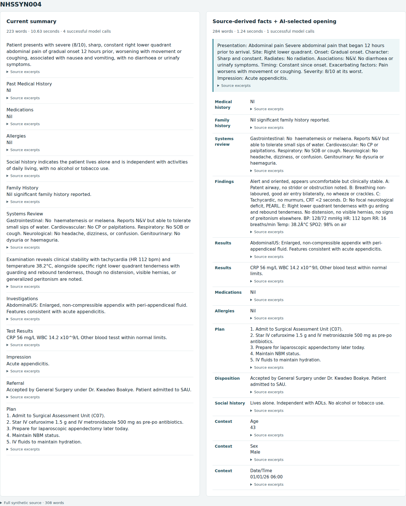

# Source-derived facts with an AI-selected opening

This comparison-only prototype tests a more constrained hybrid: **code extracts and formats facts;
AI selects the opening facts without rewriting clinical wording**. The existing gateway remains
`balanced-reviewed`. It is not a free-prose AI synopsis. That narrower model role addresses the
qualifier changes and omissions observed in the earlier [facts-table trial](DOCUMENT_FACTS.md).

## Extraction and presentation

- Known clinical headings map to stable table categories. Explicit flat lists, recognised history
  fields and observation lines can be split into smaller facts. Each keeps its source section and
  exact evidence. Nested lists, dependent bullets, unknown headings and ambiguous prose stay intact.
- Recognised identity fields and standalone signatures can be excluded. A generic “Patient” block
  is treated as identity only inside the recognised Patient/Age/Sex/NHS template; ambiguous content
  such as “Patient / Severe Pain” stays visible. An exact inline identity template retains stated
  age/sex. These are conservative template rules, not general de-identification. Embedded names,
  staff assignments, source typos and encoding artifacts can remain.
- Adjacent facts in the same section share a display row, within the existing evidence/text limits.
  Adjacent results with exactly the same normal-result predicate can share that predicate, e.g.
  “FBC: Normal” and “LFTs: Normal” become “FBC, LFTs: Normal”. Different interpretations, values,
  qualifiers and source sections are not combined this way.
- The model receives only short, whole presenting-problem/impression/procedure/disposition facts.
  It returns at most two IDs for the opening. The host moves those facts above the table and retains
  every other extracted fact. A length-split continuation cannot become an independent opening.
  There is a 50-word soft opening target and a 70-body-word cap; excess selected facts stay in the table.
- The host checks that every extracted fact occurs exactly once before identical display rows are
  consolidated with their evidence. All displayed clinical wording is source-derived. Unknown IDs,
  duplicate IDs and ineligible opening selections are rejected. The public Java validator still runs.

This needs at most one model call, capped at 256 output tokens. Documents without an eligible opening
need no call and render the extracted facts directly. No second semantic-review call is used because
there is no model-authored clinical paraphrase or model decision to omit facts. Source conservation
still does not establish that the parser classified everything correctly, that ordering preserves
all contextual meaning, or that the source itself is clinically correct.

The comparison runner validates complete committed synthetic notes before external requests. Model,
provider, no-fallback/privacy settings and byte budgets are unchanged. HTTP clients cannot choose
this experiment. The standalone preview uses the existing escaped, offline renderer and table layout.

## Ten-document result

Same longest notes from NHSSYN004–013, both modes rerun with alternating order, one completed attempt
per case/mode. All ten outputs in each mode passed their respective checks; those checks differ:
the default includes model review, while this prototype checks source retention without paraphrasing.

| Measure | Current balanced summary | Source-derived hybrid |
| --- | ---: | ---: |
| Average displayed point words | 272 | 345 |
| Median generation time | 5.00 s | 0.79 s |
| Completion tokens, all ten | 2,666 | 107 |
| Reported cost, all ten | $0.00702995 | $0.00036110 |

The hybrid used one call for nine notes and none for the mixed-format pre-operative note, which lacked
an eligible opening. It retained that note's unfamiliar narrative rather than guessing how to shorten
it. Median point length was 91% of source words versus 73% for the current summarizer. The prototype
was about six times faster at the median but **27% longer by mean word count**. This is not a reading-time
improvement. It intentionally retains routine clinical detail and repeated narrative that the current
summarizer can condense. One hosted trial is not a latency guarantee or a clinical validation study.

Saved outputs independently reconstruct exactly. Targeted source checks confirm retention of the
previously lost two-year symptom duration, reduced urinary output, scoped infection-negative wording,
pain ranges with good/bad-day qualifiers, and “no obvious deformity”. The extraction checks do not
constitute clinical review or establish perfect relevance classification.

[Metrics and source hashes](quality/2026-09-23/document-hybrid-evaluation.json) exclude full note text
and credentials. The hybrid remains experimental because reducing reading volume is the objective.
It provides a faster, more constrained extraction layer; it has not solved semantic compression.

## Reproduce

```bash
python3 tools/ai-clinical-summary-draft/compare_document_parasail.py \
  --new-patients --modes balanced hybrid --repeats 1 \
  --output /path/to/private/hybrid-comparison.json
python3 tools/ai-clinical-summary-draft/render_document_comparison.py \
  --report /path/to/private/hybrid-comparison.json --candidate hybrid \
  --output /path/to/private/hybrid-preview.html
python3 -m unittest discover -s tools/ai-clinical-summary-draft/tests -p 'test_*.py'
```

The hosted comparison incurs API charges. The renderer makes no model calls. The Python suite has
182 passing tests; new coverage includes fact conservation, malformed selections, zero-call behavior,
exact clinical qualifiers, normal-result grouping, unknown-section fallback and conservative identity
recognition. Corpus-wide checks exercise empty, single and paired eligible opening selections on all
1,602 notes, validating exact evidence, point bounds and request budgets.

The preview passed desktop/mobile browser checks, including a 390-pixel viewport without horizontal
overflow, expandable evidence, no external requests and no page errors.


