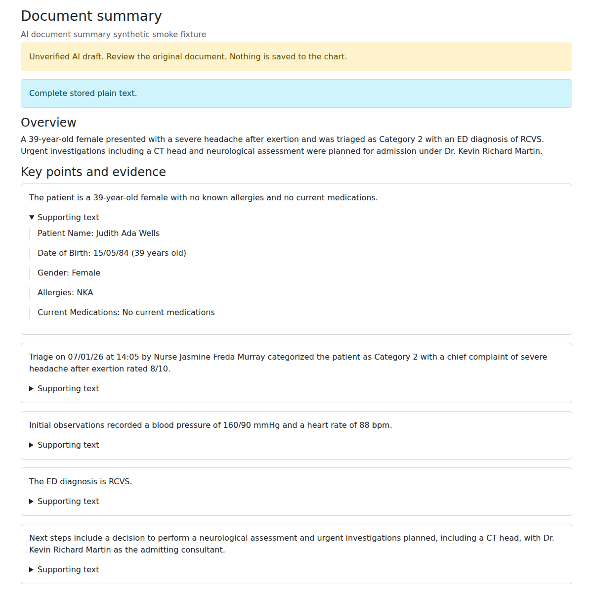

# Single-document summary prototype

Document Manager's **Summarize** button opens a preview of one authorized file. A separate
**Generate unverified draft** POST produces key points with expandable verbatim excerpts.
An optional, initially collapsed overview avoids repeating the same text in the default view. The original stays open in its existing window. No summary is saved to the
chart. Extraction warnings remain visible alongside the draft.

This is an experimental feature stacked on the patient-overview infrastructure in #3630.
It does not assemble a patient chart or use the whole-chart coverage/repair pipeline.

## Enable and use

Both flags default to false:

```properties
clinical.ai_document_summary.enabled=true
clinical.ai_summary_generation.enabled=true
```

Restart CARLOS after changing properties. Open an active patient document in Document Manager,
select **Summarize**, then **Generate unverified draft**. Existing `_edoc` read rights and
Document Manager's facility/program visibility filters apply. Non-patient, hidden, deleted,
and outbound-email archive documents are not eligible. The POST is protected by the existing
CSRFGuard filter. Generation is limited to one concurrent document per application instance.

The adapter uses the existing `clinical.ai_summary_generation.*` server configuration:

- `agent=ollama` (default): the same local model, port, timeout, bounded request/response handling,
  and check that the Ollama model is not cloud-backed. The document schema replaces the
  patient-overview schema for this operation.
- `agent=http`: the same loopback gateway port, name, timeout and request budget, but the path is
  `/v1/document-summary`. Override it with `clinical.ai_document_summary.http.path` if needed.
  A custom gateway is trusted server configuration; its operator controls downstream data handling.

The bundled OpenRouter gateway now exposes `/v1/document-summary`. Restart it from this branch
before using the new operation. It keeps the configured model/provider and routing restrictions,
uses bounded completions with at most 4,096 output tokens each, and does not cache document outputs.
**This test gateway accepts only text exactly equal to a complete note in the committed NHS
synthetic corpus.** A synthetic label is insufficient. Arbitrary files, PDF page prefixes,
partial notes, additional metadata, and changed prompts/schemas are rejected before network access.
Use a plain-text file containing exactly one corpus note to test the Document Manager workflow.
The gateway validates the incoming prompt/schema against the Java resources. Its current mode is
**balanced-reviewed**: the host retains recognized clinical sections verbatim and the model condenses
the remaining context. A separate call reviews the full source and combined draft, with at most one
revision and re-review. Normally this uses two calls, or four with revision; documents consisting
entirely of protected passages need none. Recognized medications, allergies, results, observations,
history, systems review, impression, treatment, disposition, plans and qualified negation are protected
by bounded lexical rules. Java independently validates the unchanged public output schema.
See [current coverage/readability results and limitations](DOCUMENT_BALANCED.md), the
[previous selection-only stage](DOCUMENT_READTIME.md), and the [earlier fidelity design](DOCUMENT_FIDELITY.md).


## Reuse in another CARLOS workflow

```java
// The caller owns authorization and extraction. The service has no DB/file/session access.
DocumentSummary draft = new DocumentSummaryService().summarize(authorizedExtractedText);
String overview = draft.overview();
List<Map<String, Object>> points = draft.points(); // each has text and List<String> evidence
```

Callers must enforce feature flags, privileges and record visibility **before extraction/inference**,
recheck authorization and source state before displaying the result, encode all model text for its
rendering context, and retain the unverified-draft/extraction warnings. The Document Manager action
provides the reference integration. It sends no separate document ID, patient ID, filename or document-title metadata
to the model; the one source has fixed ID `document` and title `Document`. Extracted text is sent
unchanged and may itself contain identifiers; this is not a de-identification service.

A custom in-process `ClinicalSummaryAgent` can be injected into `DocumentSummaryService`. HTTP
requests use contract version 1, workflow `single-document-summary`, classification `clinical-document`,
one `{id,title,text}` source, and the supplied instructions/schema. Replies use the existing
`{contract_version,request_id,status:"completed",output}` envelope, where output contains `overview`
and `points` (see `src/main/resources/clinical/summary/document-summary-schema.json`).

## Limits

- The shared local extractor supports UTF-8 text, stored HTML text and text-bearing PDFs up to 20 MiB.
  It does not OCR scans or interpret images, layout, scripts or externally loaded content.
- Extracted text must fit the adapter's request budget. Oversized documents are rejected rather
  than silently truncated or split. Model truncation, invalid JSON and refused completions fail closed.
- Each point must cite 1–5 distinct, exact excerpts and share a word or numeric token with them.
  Duplicate points and malformed fields are rejected. These are **provenance/format checks, not
  proof of clinical correctness**: overlapping words cannot establish negation, dose accuracy,
  entailment or completeness. The overview is checked for lexical overlap, but has no separate
  evidence array. Always review the original.
- The bundled gateway's numbered passages keep headings with values and split long paragraphs
  into excerpts of at most 800 UTF-16 units. It rejects unknown IDs and malformed reference
  output, and provider requests exceeding the configured byte budget. Passage citations may be
  broader than a hand-selected quotation and may include identifying text already in the source.
  Repeated identical IDs within a generated point are deduplicated before final validation.
  Citations do not establish that the model's claim follows from the cited passage.
- Protected points reproduce source text with display line endings normalized. Source errors,
  contradictions, typos and embedded identifiers remain. Other context is paraphrased and can still
  omit or misrepresent relevant facts despite numerical/lexical checks and full-source model review.
  These are not comprehensive clinical checks. Completeness takes priority over a word target;
  dense notes may remain nearly intact. Model approval does not verify clinical correctness.
- Generated text is request-scoped. Audit entries identify the operation/document, not extracted
  text or generated prose. The shared extractor retains a bounded in-memory text cache as before.
- The built-in gateway is a synthetic-data test bench, not a route for real documents to OpenRouter.

## Verification

```bash
nice -n 10 mvn -o -B test '-Dtest=io.github.carlos_emr.carlos.clinical.**.*Test' \
  -DfailIfNoTests=false -Dsurefire.failIfNoSpecifiedTests=false
python3 -m unittest discover -s tools/ai-clinical-summary-draft/tests -p 'test_*.py'
```

Java tests cover the service, both transports, HTTP reply correlation, cloud-backed Ollama rejection,
method/flag/ID/privilege checks, document visibility, extraction failures, and changes to access,
metadata or file text while inference runs. Python tests cover the synthetic allow-list before
network access, exact prompt/schema, metadata rejection, budgets, output validation and HTTP routing.

Manual browser check against an authenticated isolated development instance (synthetic file only):

```bash
NODE_PATH=/usr/local/lib/node_modules \
DOCUMENT_SUMMARY_URL=http://127.0.0.1:8081/carlos \
DOCUMENT_SUMMARY_ID=<synthetic-document-id> \
DOCUMENT_SUMMARY_STORAGE_STATE=<authenticated-storage-state.json> \
DOCUMENT_SUMMARY_OUTPUT_DIR=<private-output-directory> \
node tools/ai-clinical-summary-draft/tests/document-summary-browser-checks.cjs
```

### Current verification, 2026-09-23

The balanced workflow passed the Python suite (162 tests) and the isolated browser check (seven
points in 11.07 seconds). On ten synthetic patients, all drafts passed structural/provenance,
protected-passage and model-review checks, with a median point length of 72% of source words and
15.76-second median generation time. This is a reading-volume proxy, not clinical validation or
measured reading time. See [the full results](DOCUMENT_BALANCED.md). A subsequent
[overview-and-facts experiment](DOCUMENT_FACTS.md) adds a local table preview and comparison mode;
it is not adopted by the gateway. A subsequent [source-derived hybrid](DOCUMENT_HYBRID.md) tests deterministic fact extraction and
AI-selected emphasis; it also remains experimental. The expanded Python suite has 182 passing tests.

### Historical exploratory live results, 2026-09-23

Using the existing local gateway configuration (`qwen/qwen3.5-35b-a3b`, Parasail via OpenRouter),
three complete synthetic notes from NHSSYN001 were sent individually, without output caching:

| Extract characters | Latency | Result |
| --- | --- | --- |
| 759 | 3.29 s | Accepted, 6 points |
| 853 | 3.91 s | Accepted, 9 points |
| 2,464 | 6.87 s | Rejected: non-verbatim evidence |

The longer note contains line-separated fields and encoding artifacts. Earlier attempts showed
the model joining labels to values and correcting a corrupted degree symbol inside evidence.
Explicit instructions to preserve line breaks and encoding did not reliably prevent rejection.
This remains an open quality limitation; the host does not silently accept altered quotations.
These are small exploratory measurements, not a clinical accuracy evaluation or latency guarantee.

A subsequent [three-model comparison](DOCUMENT_MODEL_COMPARISON.md) tests the current model
against Qwen3-30B-A3B-Instruct and Nemotron-3-Nano-30B-A3B on six synthetic documents, twice each,
including manual review of uncertainty, medication plans, and identifying text.

The isolated browser check also passed with the 759-character synthetic note: 5 points in 4.7 seconds
(including the form round trip). It verified POST-only generation, invalid-ID rejection, CSRF rejection,
no-store responses, loaded styling, expandable evidence, retained extraction notices and no page errors.
The Document Manager button opened the expected preview popup. All 194 Java clinical tests and 113
Python draft-tool tests passed; Struts DTD, encoding and locale-key checks passed.


